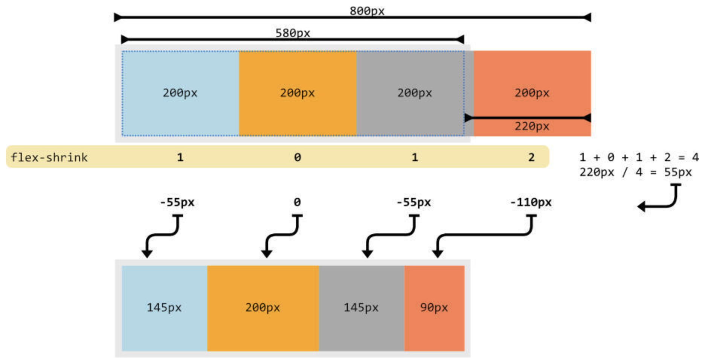
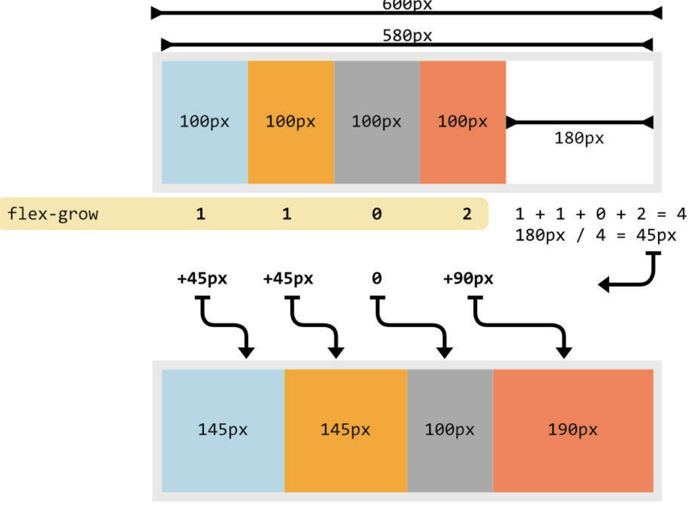

# Flex

## align-items 와 align-content 차이

**공통점**

- 둘다 cross-axis 기준 정렬.

**차이점**

- align-items : flex-line을 기준으로 아이템을 정렬
- align-content : flex-line을 정렬

> align-content는 nowrap인 경우 사용하는 의미가 없음. nowrap은 강제로 한 줄에 그리기 때문에 flex-line이 하나 뿐이기 때문.

## flex-shrink

> 레이아웃을 벗어난 flex 아이템 너비를 분배해서 줄이는 속성

- 부모 요소의 flex-wrap이 nowrap을 적용한 경우만 동작.
- flex-shrink값이 1은 기본값으로 자동으로 아이템이 축소됨.
- 자동 축소를 방지하려면 0으로 설정.

## flex-grow

> flex 박스의 남은 행 여백을 flex 아이템으로 분배해서 채우는 속성

- flex-grow속성을 적용하지 않거나 0인 경우 여백이 있어도 아이템을 늘리지 않음.

## flex-basis

> flex 아이템의 기본 사이즈를 지정하는 속성

- 기본값은 auto로 컨텐츠 크기에 따라 사이즈가 변경
- flex-direction에 따라 row(width), column(height)를 설정
