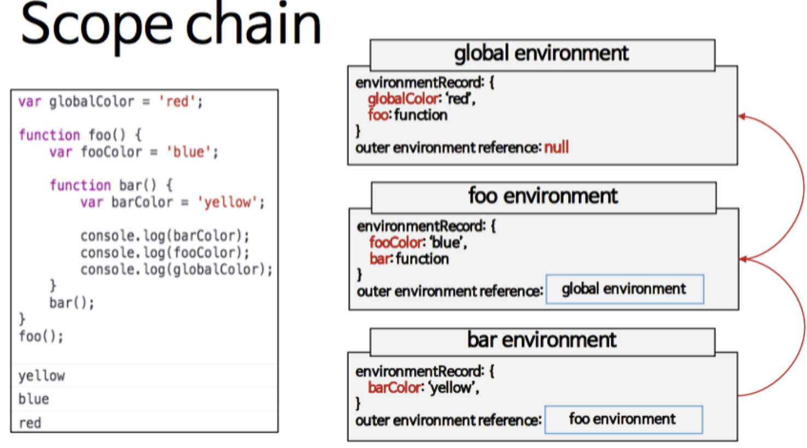

# 스코프와 클로저

1. Scope(유효범위)
   - 전역 스코프 : 스크립트 전체에서 참조
   - 지역 스코프 : 정의된 함수 내에서만 참조가능.

## 유효범위의 특징

- 함수 단위 유효범위
- 함수 블럭 내에서 선언된 변수는 함수 내부에서만 유효함.
- es6부터 let을 이용하면 블럭단위 유효범위가 적용가능.
  - 변수명 중복 허용
    - 전역에 선언한 변수는 어느 곳에서든 접근 가능.
  - 암묵적 선언
  - 변수 선언에 접근 지정자(let, var)를 선언하지 않으면 암묵적 전연변수로 선언.
- 렉시컬 유효범위
  - 자바스크립트는 함수가 선언된 시점에서의 유효범위를 가진다.

1. 스코프체인  
   식별자(identifier)를 참조할 때, 어떤 대상을 참조할 지 찾아내기 위한 규칙.  
   새롭게 정의된 스코프는 상위의 스코프에 접근할 수 있다.  
   스코프 체인은 가장 내부에서 scope chain을 따라 바깥쪽으로 검색하게 된다.



1. 클로저
   - 함수가 선언된 환경의 (렉시컬)스코프를 기억하며 함수가 스코프 밖에서 실행될 때에도 이 스코프에 접근할 수 있는 기술
     > 내부함수에서 외부함수의 지역변수에 접근 할 수 있는데 외부함수의 실행이 끝나서 외부함수가 소멸된 이후에도 내부함수가 외부함수의 변수에 접근 할 수 있다. 이러한 메커니즘을 클로저라고 한다.

## 클로저의 이점

- 전연변수의 사용억제(의도하지 않은 접근을 막아 코드 안정성이 업)

  ```typescript
  // Box Color Toggler
  const box = document.querySelector('.box');

  const toggleColor = (function () {
    let isGreen = true;
    // 클로저 반환
    return function () {
      box.style.background = isGreen ? 'red' : 'green';
      // 상태 변경
      isGreen = !isGreen;
    };
  })();
  // 박스 클릭 이벤트
  box.addEventListener('click', toggleColor);
  ```

- primate method 흉내내기

```typescript
let counter = (function () {
  let privateCounter = 0;
  function changeBy(val) {
    privateCounter += val;
  }
  return {
    increment: function () {
      changeBy(1);
    },
    decrement: function () {
      changeBy(-1);
    },
    value: function () {
      return privateCounter;
    }
  };
})();

console.log(counter.value()); // logs 0
counter.increment();
counter.increment();
console.log(counter.value()); // logs 2
counter.decrement();
console.log(counter.value()); // logs 1
```
