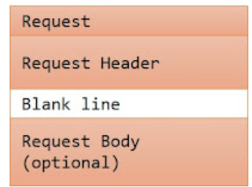
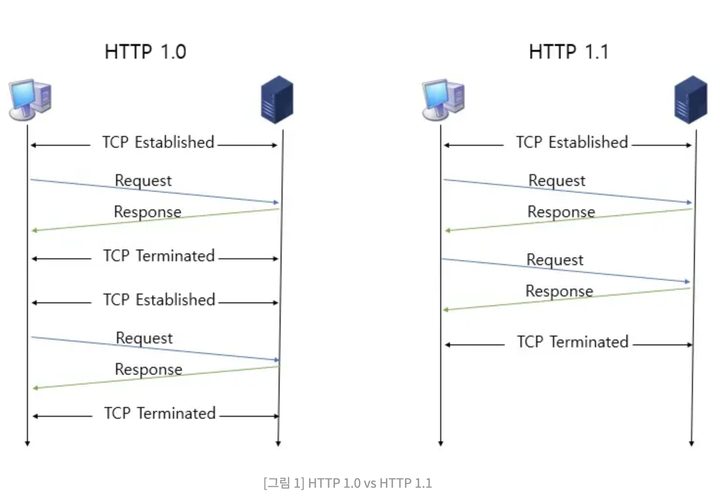
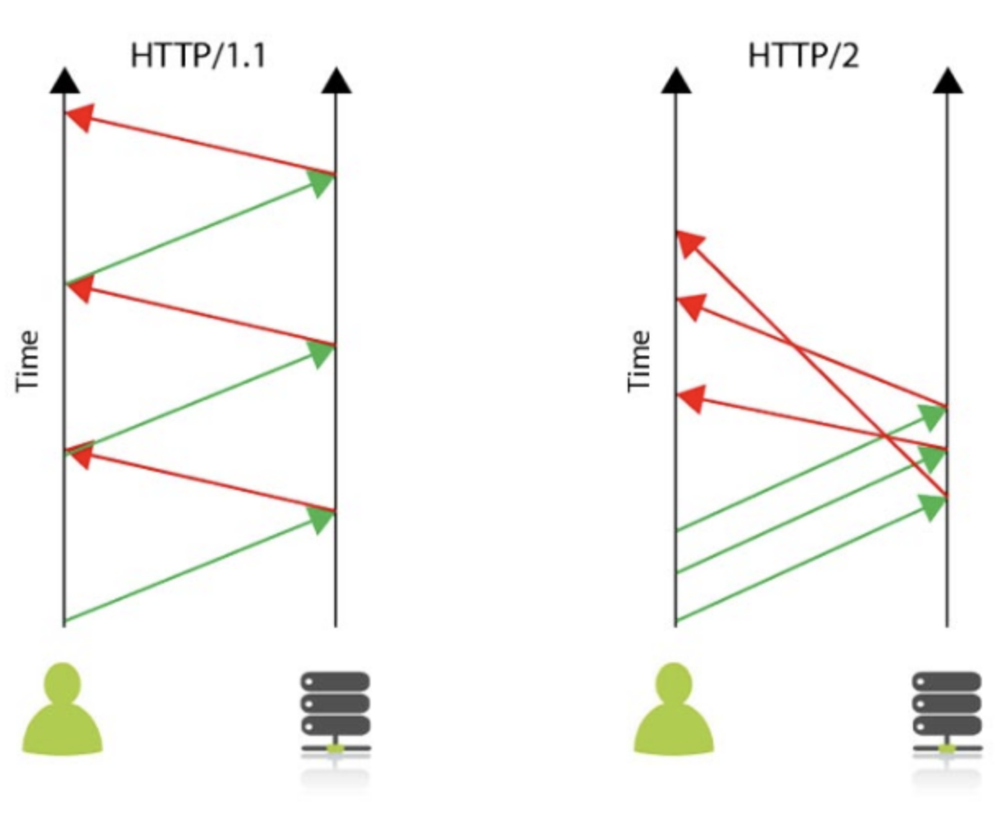

## HTTP프로토콜 구조 개요

- Hyper Transfer Protocol의 약자.
- OSI 레이어의 가상 상위 단의 application layer에 속한다.
- HTTP는 TCP/IP 연결 위에, HTTPS는 SSL위에 올라가 있음
- HTTP클라이언트에서 HTTP서버로 요청을 보내고, 요청을 받은 서버는 클라이언트에게 상황에 맞는 응답을 보내는 형태.

요청 형식

```text
GET / HTTP/1.1
Host: ryanclaire.blogspot.com
Connection: keep-alive
DNT: 1
Upgrade-Insecure-Requests: 1
User-Agent: Mozilla/5.0 (Windows NT 10.0; Win64; x64) AppleWebKit/537.36 (KHTML, like Gecko) Chrome/86.0.4240.75 Safari/537.36
Accept: text/html,application/xhtml+xml,application/xml;q=0.9,image/avif,image/webp,image/apng,*/*;q=0.8,application/signed-exchange;v=b3;q=0.9
Accept-Encoding: gzip, deflate
Accept-Language: ko-KR,ko;q=0.9,en-US;q=0.8,en;q=0.7
```

응답 형식

```text
HTTP/1.1 200 OK
Content-Type: text/html; charset=UTF-8
Expires: Fri, 16 Oct 2020 03:24:32 GMT
Date: Fri, 16 Oct 2020 03:24:32 GMT
Cache-Control: private, max-age=0
Last-Modified: Thu, 15 Oct 2020 14:47:59 GMT
ETag: W/"5ff21f5b961238a44cb1cd27f6e753ccd873730fc8c28050213852c3fa960c18"
Content-Encoding: gzip
X-Content-Type-Options: nosniff
X-XSS-Protection: 1; mode=block
Server: GSE
Alt-Svc: h3-Q050=":443"; ma=2592000,h3-29=":443"; ma=2592000,h3-27=":443"; ma=2592000,h3-T051=":443"; ma=2592000,h3-T050=":443"; ma=2592000,h3-Q046=":443"; ma=2592000,h3-Q043=":443"; ma=2592000,quic=":443"; ma=2592000; v="46,43"
Transfer-Encoding: chunked

-- 중략 --
```

## HTTP Request Message



### HTTP Request Method

- GET : 클라이언트가 서버에서 웹 리소스를 받아올 때 사용
- HEAD : GET을 통해 받아오는 Response의 Header를 받아 올 수 있다( 응답은 없이 웹 서버에 존재여부만 확인 가능 )
- POST : 웹 서버에 데이터를 보낼 때 사용한다.
- PUT : 서버에 데이터를 저장할 때 사용한다.
- DELETE : 서버에 데이터 삭제를 요청할 때 사용한다.
- TRACE : 수행 작업의 네트웍크 경로를 체크하는 메서드.( 헤더에 Via 정보가 추가됨 )
- OPTIONS : 서버가 지원하는 http요청방식을 응답헤더에 포함해 전달.

### HTTP Request Header

- HOST : 도메인 이름
- Accept : 클라이언트가 다룰 수 있는 MINE 타입이 열거됨.
- Accept-Language : 클라이언트가 다룰 수 있고 선호하는 언어 타입이 열거.
- Accept-Charset : 클라이언트가 다룰 수 있고 선호하는 문자 집합이 열거 ( utf-8, euc-kr )
- Accept-Encoding : 클라이언트가 지원하는 Encoding타입이 열거 ( gzip, deflate )
- Connection : Request후 연결을 닫을 것인지 유지할 지를 나타냄 ( Close / Keep-Alive )
- User-Agent : Request가 만들어진 브라우저 정보
- Content-Length : POST요청 시 Body의 데이터 길이
- Content-Type : POST요청 시 Body의 데이터 형식을 MIME타입으로 표시

## HTTP Response Message

요청과 동일하게 Status, Response Header, Blank line, Response Body로 구성됨.

### status line 형식

> HTTP_Version Status_code Resason_Phrase( HTTP_Version 은 HTTP/1.0, HTTP/1.1 둘 중 하나 )

### Status code

상태코드는 3자리로 Request에 대한 응답으로 서버에서 생성한다.

- 1xx(Information) : 서버의 상태 정보.
- 2xx(Success) : 요청을 수신하였고, 의미를 이해했으며, 이를 처리했다는 의미.
- 3xx(Redirection) : 요청을 처리하기 위해 다른 액션이 필요하다는 의미

  - 301( Move Permanently ) : 요청된 리소스의 위치가 영구적으로 변경됨
  - 302( Found & Redirect ) : 요청된 리소스의 위치가 임시적으로 변경됨

- 4xx(Client Error) : Request에 문법 오류가 있거나 의미를 이해하지 못함을 의미

  - 400 ( Bad Request ) : 서버에서 Request를 이해하지 못함, 구문의 오류가 있을 가능성이 있음을 의미
  - 403 ( Forbidden ) : 클라이언트의 신원에 상관없이 서버에서 리소스 제공을 거부함을 의미
  - 404 ( Not Found ) : 요청된 리로스를 서버에서 찾지 못함.
  - 405 ( Method Not Allowed ) : 클라이언트에서 요청한 Request 서버에서 허용하지 않음.

- 5xx (Server Error) : 서버에서 요청을 처리하지 못함.
  - 500 ( Internal Server Error ) : 서버 내부 프로그램 오류
  - 501 ( Method Not Implemented ) : Request Method가 잘못됨.
  - 502 ( Bad Gateway ) : 프록시 또는 게이트웨이는 업스트림 서버에서 잘못된 응답을 수신했음을 의미한다
  - 503 ( Service Unavailable ) : 과부하나 유지보수로 인해 서버가 응답할 수 없음.

### Response Header

- Location : 요청완료 또는 새 리소스 식별을 위해 요청된 URI가 아닌 위치로 Redirection하는데 사용.
- Server : 요청처리를 위한 서버의 소프트웨어 정보
- WWW-Authenticate : Request-URI에 적용될 수 있는 인증체계와 매개변수 정보
- Allow : Request-URI에서 지원하는 Method가 열거
- Content-Encoding : Body에 포함된 컨텐츠의 인코딩의 형태를 알려주는데 사용.( Content-Encoding:gzip )
- Content-Type : 컨텐츠의 미디어 타입을 나타냄. (Content-Type:text/html; charset=ISO-8859-4)
- Expires : 컨텐츠 유효기간 표시 date/time을 제공하는데 사용.( Expires: Fri, 16 Oct 2020 03:24:32 GMT )

## HTTP1.0 과 HTTP1.1 차이

> 1.0과 1.1의 가장 큰 차이는 세션을 유지여부



- 1.0은 요청마다 TCP세션을 맺어야 하고 1.1은 하나의 TCP세션에 여러요청 가능.
  - 그래도 1:1요청만 가능
  - 2.0은 여러 요청을 동시에 가능
- 1.0은 요청에 대한 응답전에는 다른 요청이 안됨 1.1은 가능
- 가상 호스트를 통해 하나의 IP주소로 여러 도메인 적용 가능( 1.0은 지원 안됨 )

## HTTP1.1 과 HTTP2.0 차이



- 동시전송 및 다수 리소스 처리 가능
  - 2.0이전에는 프론트에서 이런 문제를 우회하기 위해 서버호출을 줄이기 위해 이미지 스프라이트, CSS/JS 압축, Data URI등을 이용.
