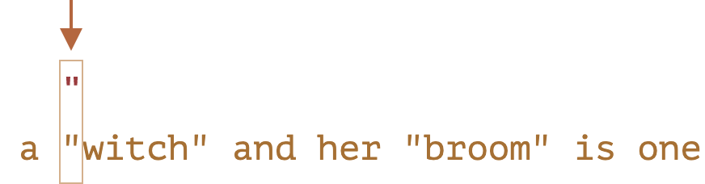
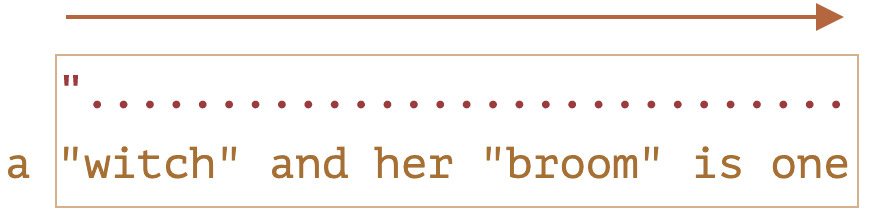
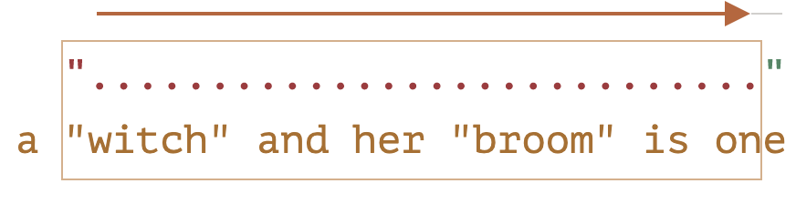
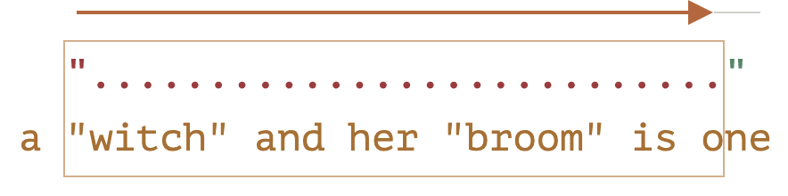
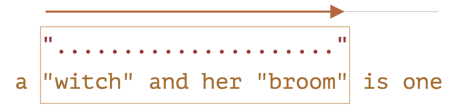

## Greedy and lazy 수량자

정규식에 수량자는 언뜻보면 사용법이 직관적이라 생각하기 쉽지만 주의해야 할 점이 있다.  
예를 들어 다음과 같은 정규식 <mark>/".+"/</mark> 을 이용해 쌍따옴표로 묶인 단어를 찾는다고 해보자.

```javascript
let regexp = /".+"/g;
let str = 'a "witch" and her "broom" is one';
alert(str.match(regexp)); // "witch" and her "broom"
```

결과는 예상과 다르게 나오는 걸 볼 수 있다.

> "witch" and her "broom"

### Greedy search

정규식 표현을 찾기 위해 엔진은 다음과 같은 행동을 한다.

- 문자열의 시작인 a를 조사하고 매칭이 안되는 것을 알고 다음으로 이동
- 패턴과 일치하는 <mark>"</mark> 를 만나고 다음 매칭여부를 체크한다.
  
- <mark>.</mark> 를 통해 w와 매칭을 확인하고 다음으로 이동.
  
- <mark>+</mark> 를 통해 문자열의 마지막까지 매칭을 확인하며 이동.
  
- 문자열의 마지막에 도달하고 <mark>"</mark> 와 일치하지 않음을 확인.
  
- 문자열의 마지막에서 위치를 앞으로 이동하며 매칭확인.
  
- <mark>"</mark> 를 만나는 위치에서 매칭을 종료.
  
- <mark>g</mark> 플래그를 가지고 있으므로 첫 매칭이 끝난 다음 위치에서 패턴의 시작문자인 <mark>"</mark>를 찾으려 하고 남은 문자 <mark>is one</mark> 와 매칭되는 곳이 없으니 탐색은 종료된다.

regexp 엔진은 <mark>.+</mark> 에 대해 가능한 한 많은 문자를 일치 항목에 추가한 다음 패턴의 나머지 부분이 일치하지 않으면 하나씩 줄입니다.

### lazy mode

게으름 모드는 탐욕 모드와 반대입니다. "최소한의 횟수만큼 반복하라"는 뜻입니다.  
수량자 뒤에 물음표 '?'를 추가해 사용할 수 있으며 적용예는 다음과 같다 <mark>\*?</mark>, <mark>+?</mark>, <mark> ?? </mark>

게으른 탐색은 수량자 뒤에 <mark>?</mark>를 붙여야 하고 그렇지 않은 경우 모든 검색은 탐욕적으로 동작한다.

```javascript
alert('123 456'.match(/\d+ \d+?/)); // 123 4
```

- 패턴 <mark>\d+</mark>(greedy mode)를 기반으로 가능한 많은 숫자를 매칭하고, 결과로 <mark>123</mark>를 찾은 후 멈춘다.
- 다음 위치에서 공백과 매칭을 확인하고 다음으로 이동
- 패턴 <mark>\d+</mark> (lazy mode)를 기반으로 하나의 숫자 <mark>4</mark>를 찾은 후 거기에서 나머지 패턴의 일치 여부를 확인한다.
- 하지만 <mark>\d+?</mark> 이후에 존재하는 패턴은 없고 엔진은 탐색은 종료한다.

> 최적화  
> 최신 정규식 엔진은 더 빠르게 작동하도록 내부 알고리즘을 최적화할 수 있어 설명된 알고리즘과 약간 다르게 작동할 수 있지만 이를 이해하고 정규식을 작성하기 위해 이에 대해 알 필요는 없습니다. 그것들은 사물을 최적화하기 위해 내부적으로만 사용됩니다.

### Alernative approach

정규식 표현은 동일한 동작을 하는 표현이 두 가지 이상인 경우가 많은데
앞에서 따옴표 사이에 있는 단어를 찾기 위한 패턴을  
<mark>"[^"]+" </mark>  
위와 같이 사용하며 lazy mode없이 찾을 수 있다.

```javascript
let regexp = /"[^"]+"/g;
let str = 'a "witch" and her "broom" is one';
alert(str.match(regexp)); // witch, broom
```

<sub>**이 표현은 게으른 탐색을 대체하는게 아니라 다른 표현입니다.**</sub>

### lazy 탐색이 greedy탐욕과 같이 오작동 하는 경우

html태그에서 a태그의 href속성이 다양한 패턴을 찾는다고 생각해 보자.

> \<a href="..." class="doc" >

가장 쉽게 생각할 수 있는 패턴은 다음과 같을 것이다.

```javascript
const pattern = /<a href=".*" class="doc">/g;
```

이제 어떻게 동작하는지 결과를 확인하자.

```javascript
const pattern = /<a href=".*"> class="doc">/g;
const str = '...<a href="link" class="doc">...';
alert(str.match(pattern)); // <a href="link" class="doc">
```

생각대로 동작한다. 하지만 문자열에서 찾아야할 링크가 많아질 경우는 어떻게 될지 보자.

```javascript
const pattern = /<a href=".*"> class="doc">/g;
const str = '...<a href="link1" class="doc">... <a href="link2" class="doc">...';
alert(str.match(pattern)); // <a href="link1" class="doc">... <a href="link2" class="doc">
```

결과는 앞에서 본 것처럼 <mark>.\*</mark> 패턴이 너무 많은 문자열을 매칭시켜 예상치 못한 결과가 나온다.

이제 게으른 수량자를 통해 이 문제를 해결해 보자.

```javascript
const pattern = /<a href=".*?"> class="doc">/g;
const str = '...<a href="link1" class="doc">... <a href="link2" class="doc">...';
alert(str.match(pattern));
```

원하는 것처럼 두 개의 매칭결과를 확인 할 수 있다.  
여기서 하나의 테스트를 더 해보겠습니다.

```javascript
const pattern = /<a href=".*?"> class="doc">/g;
const str = '...<a href="link1" class="wrong">... <p style="doc">...';
alert(str.match(pattern)); // <a href="link1" class="wrong">... <p style="" class="doc">
```

결과는 실패하고 문자열 전체가 포함됩니다.

무엇이 문제인지 생각해 봅니다.

- 먼저 정규식은 <mark>\<a href=\"</mark> 로 시작하는 링크를 찾습니다.
- 그런 다음 <mark>.\*?</mark>를 찾습니다. 한 문자를 가져옵니다(느리게!). <mark>" class="doc"></mark>에 일치하는 항목이 있는지 확인합니다(없음).
- 그런 다음 다른 문자를 <mark>.\*?</mark> 로 가져오는 식으로… 마침내 <mark>" class="doc"></mark>에 도달할 때까지 계속합니다.

그러나 문제는 이것이 이미 <mark><a...></mark>링크 너머에 있는 다른 태그 <mark><p></mark>에 있다는 것으로 결과는 null을 반영해야 합니다.

```html
<a href="..................................." class="doc">
  <a href="link1" class="wrong"
    >...
    <p style="" class="doc"></p></a
></a>
```

이 문제 해결을 위해서는 <mark>\<a href="something..." class="doc"></mark>을 찾을 수 있는 패턴이 필요하고 greedy, lazy 탐색 모두 문제를 가지고 있다.
올바른 패턴은 <mark>href="[^"]\*"</mark>으로 이제 해결하고자 하는 모든 문제를 해결할 수 있습니다.

```javascript
let str1 = '...<a href="link1" class="wrong">...<p style="" class="doc">...';
let str2 = '...<a href="link1" class="doc">...<a href="link2" class="doc">...';
let regexp = /<a href="[^"]*" class="doc">/g;
// Works!
alert(str1.match(regexp)); // null, no matches, that's correct
alert(str2.match(regexp)); //<a href="link1" class="doc">, <a href="link2" class="doc">
```
